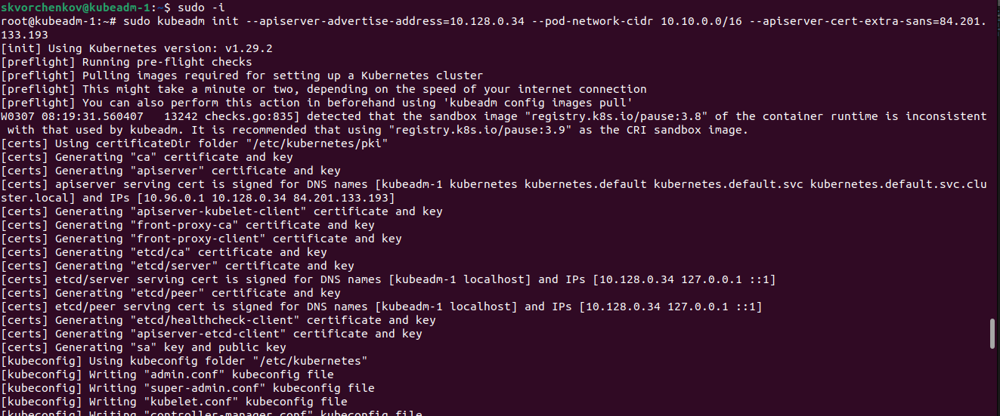

# kuber-12# Домашнее задание к занятию "Установка Kubernetes"

### Цель задания

Установить кластер K8s.

### Чеклист готовности к домашнему заданию

1. Развернутые ВМ с ОС Ubuntu 20.04-lts

### Инструменты и дополнительные материалы, которые пригодятся для выполнения задания

1. [Инструкция по установке kubeadm](https://kubernetes.io/docs/setup/production-environment/tools/kubeadm/create-cluster-kubeadm/)
2. [Документация kubespray](https://kubespray.io/)

-----

### Задание 1. Установить кластер k8s с 1 master node

1. Подготовка работы кластера из 5 нод: 1 мастер и 4 рабочие ноды.
2. В качестве CRI — containerd.
3. Запуск etcd производить на мастере.
4. Способ установки выбрать самостоятельно.

#### Ответ на задание 1:

Для начала создал 2 ВМ под мастер и рабочий ноды:

Настраиваем мастер ноду на ВМ kubeadm-1:

Инициируем мастер ноду, настраиваем конфиг и проверяем:

Нода имеет статус NotReady. Для исправления проблемы нужно включить сетевой плагин:

Нода поменяла статус на Ready:

Для рабочей ноды проделываем все тоже самое на kubeadm-2 и потом добавляем ее на мастер ноду:

Проверяем добавление на мастер ноде:

Создаем остальные 3 рабочие ноды и добавляем их на мастер ноду:

## Дополнительные задания (со звездочкой*)

**Настоятельно рекомендуем выполнять все задания под звёздочкой.**   Их выполнение поможет глубже разобраться в материале.   
Задания под звёздочкой дополнительные (необязательные к выполнению) и никак не повлияют на получение вами зачета по этому домашнему заданию. 

------
### Задание 2*. Установить HA кластер

1. Установить кластер в режиме HA
2. Использовать нечетное кол-во Master-node
3. Для cluster ip использовать keepalived или другой способ

### Правила приема работы

1. Домашняя работа оформляется в своем Git репозитории в файле README.md. Выполненное домашнее задание пришлите ссылкой на .md-файл в вашем репозитории.
2. Файл README.md должен содержать скриншоты вывода необходимых команд `kubectl get nodes`, а также скриншоты результатов
3. Репозиторий должен содержать тексты манифестов или ссылки на них в файле README.md